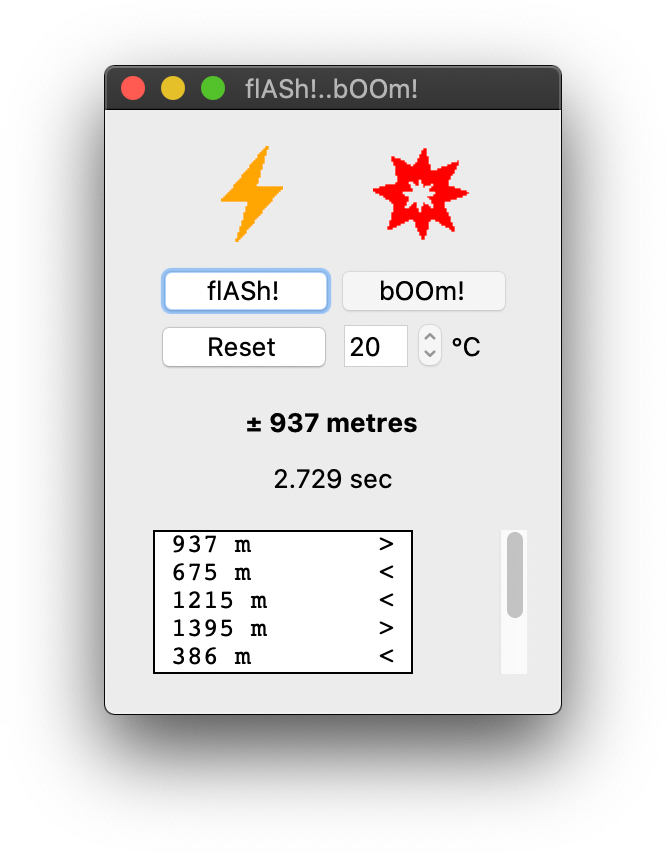

# flASh!..bOOm!
> Python script to estimate the distance of lightning.

Estimate the distance of lightning by measuring the time between the 'flash'
and the 'boom' during a thunderstorm *(or any other event you can see before
you can hear because of the distance).*
For increased accuracy, the air temperature can also be set in order to
fine-tune the *speed of sound* to the conditions.



## Installation

**macOS & Linux:**
Just save the *FlashBoom* folder to a location of your choosing.

**Windows:**
This script hasn't been tested on Windows, but should work (?) the same as
with Mac & Linux systems.

## Requirements

* [Python 3.7](https://www.python.org "Python's homepage")

To check which version of Python3 you have (if any), open a terminal and type:

```
python3 -V
```

*(flASh!..bOOm! was developed using Python 3.7.5 on macOS Catalina.)*

## Usage

Open a terminal and *cd* to the *FlashBoom* directory, then execute the
``flashboom.py`` file with Python:

```
python3 flashboom.py
```

Whenever the *flASh!* button is pressed (with LMB or SPACE) the timer will
reset and start. After the flash, pressing the *bOOm!* button will stop the
timer and display the distance estimation in metres.
The *Reset* button clears the display and the history box. It will also stop
the timer if it was running.

To increase the accuracy, the air temperature can be set as well (°Celcius).
Do this by hovering the mouse-pointer over the spinbox and turning the
mouse-wheel. (On Linux the entire spinbox may be greyed out, it still works
though.)

## Release History

* 0.0.2
    * Time feedback added.
    * Some minor adjustments.
* 0.0.1
    * Work in progress.

## Meta

tumtidum

Distributed under the GNU GPLv3 license. See ``LICENSE`` for more information.

[https://github.com/tumtidum](https://github.com/tumtidum)
